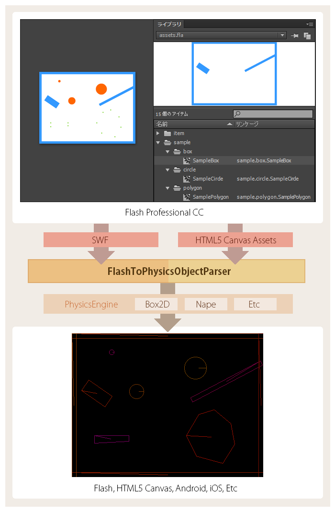
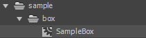
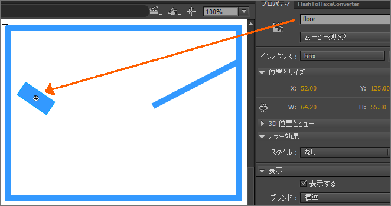
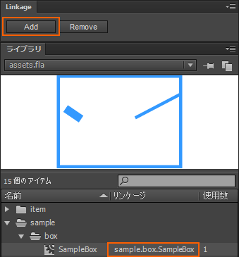
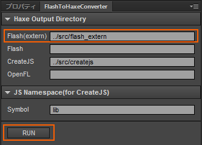
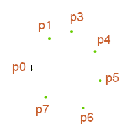

<link href="document/style.css" rel="stylesheet"></link>

FlashToPhysicsObjectParser
=============================

FlashToPhysicsObjectParser は、Flash Professional CC のシンボル内 各数値(幅・高さ・配置位置・回転角度・頂点座標)を物理演算ライブラリ用に抽出する Haxe ライブラリです。

## 機能

### 名前を設定していない匿名シンボルを解析

プロパティ名を設定したシンボルの他、プロパティ名を設定していない匿名シンボルの解析も行えます。ゲームの障害物といった、スクリプト操作を行う必要のない ただ配置するだけの静的なオブジェクト等に利用できます。

### HTML5 Canvas ドキュメントから出力されたデータの解析

swf の他、やや独特なフォーマットの HTML5 Canvas 用出力データ(CreateJS用データ)の解析を行えます。HTML5 Canvas 用出力データを解析するためには、以下の Haxe-CreateJS ライブラリをクラスパスに追加する必要があります。

[https://github.com/nickalie/CreateJS-Haxe](https://github.com/nickalie/CreateJS-Haxe)

## 矩形シンボル Box の設定

矩形シンボルを FlashToPhysicsObjectParser にて解析する手順を記述します。サンプルファイルと合わせてご確認ください。

### 前準備

Flash CC の出力素材データを Haxe から簡単に利用するため、以下二つの JSFL(Flash CC 拡張機能) をインストールします。

* [FlashToHaxeConverter](https://github.com/siratama/Flash-To-Haxe-Converter)
* [Linkage](https://github.com/siratama/Linkage)

### オーサリング

Flash ファイル assets.fla を作成します。

#### ライブラリ内に sample/box/SampleBox ムービークリップを作成

#### sample/box/SampleBox ムービークリップ内に矩形シンボルを配置

スクリプトで制御したい矩形シンボルにはプロパティ名を設定します。ここでは floor という名前を設定します。

#### sample/box/SampleBox ムービークリップにリンケージ設定

拡張機能 Linkage を利用して、SampleBox ムービークリップにリンケージ設定を行います。

#### リンケージ設定を行ったムービークリップの構造を Haxe ファイルに出力

拡張機能 FlashToHaxeConverter を利用して SampleBox ムービークリップの構造を Haxe ファイルに出力します。

#### swf パブリッシュ

Flash CC のパブリッシュコマンドで assets.swf ファイルを出力します。Haxe のコンパイラオプション -swf-lib 指定で assets.swf を指定します。

### FlashToPhysicsObjectParser の利用

Haxe でプログラミングを行います。まずは FlashToPhysicsObjectParser クラスのインスタンスを生成します。

	var flashToPhysicsObjectParser = new FlashToPhysicsObjectParser();

次に register メソッドで解析対象のムービークリップを登録します。SampleBox は矩形として解析を行うため、PhysicsObjectType.BOX を第一引数に指定します。SampleBox クラスは FlashToHaxeConverter で出力されたクラスファイルです。register メソッドは第二引数で指定したクラスインスタンスを返却するので保持しておきます。

	var sampleBox:SampleBox = flashToPhysicsObjectParser.register(PhysicsObjectType.BOX, SampleBox);

登録完了後 execute メソッドで解析を行います。

	flashToPhysicsObjectParser.execute();

解析後は、getPhysicsObject メソッドを呼び出すことで、矩形データとして各数値が抽出された PhysicsObject インスタンスを取得できます。Flash CC で floor というプロパティ名で設定したシンボルを取得するには、以下の様な指定を行います。FlashToHaxeConverter 経由で出力された SampleBox クラス内には floor プロパティが用意されています。

	var physicsObject = flashToPhysicsObjectParser.getPhysicsObject(sampleBox, sampleBox.floor);

PhysicsObject インスタンスには floor シンボルの位置情報や幅・高さ等の各データが解析されています。これら各数値を利用して、物理演算ライブラリのオブジェクト生成を行います。

	trace(physicsObject);
	//x: 52
	//y: 125
	//width: 26
	//height: 60
	//degree: -55.704...
	//radian: -0.9721...

プロパティ名を設定していないシンボルは getAnonymousPhysicsObjectSet メソッドで取得可能です。

	var anonymousSet = flashToPhysicsObjectParser.getAnonymousPhysicsObjectSet(sampleBox);
	for(anonymousPhysicsObject in anonymousSet)
		trace(anonymousPhysicsObject);

## 正円 Circle の設定

矩形 Box と設定方法はほぼ同じのため、説明は省略します。

## 頂点座標の集合体 Polygon の設定

### オーサリングルール

頂点座標となるムービークリップ名は、デフォルトでは「p」+「数字」の 0 から始まる連番にする必要があります。詳しくは sample/fla/assets.fla ファイル内　sample/polygon/SamplePolygon ムービークリップをご参考ください。

頭文字「p」の文字は、PhysicsPolygon クラス内 VERTEX_MOVIE_CLIP_HEAD_NAME に定義しています。

	public static var VERTEX_MOVIE_CLIP_HEAD_NAME:String = "p";

以下のように変更する事が可能です。

	PhsycsPolygon.VERTEX_MOVIE_CLIP_HEAD_NAME = "a";

ムービークリッププロパティ名のルールから、頭文字として英文字をかならず設定する必要があります。

### 頂点座標クラス変換

FlashToPhysicsObjectParser.getPhysicsObject メソッドの戻り値を cast して PhysicsPolygon として取得します。

	var polygon:PhysicsPolygon =
		cast flashToPhysicsObjectParser.getPhysicsObject(samplePolygon, samplePolygon.flipper);

PhysicsPolygon クラスは、頂点座標 Point(flash.geom.Point or createjs.easeljs.Point)クラスのの配列 vertices を所持しています。

	public var vertices(default, null):Array<Point>;

物理演算ライブラリ Box2D や Nape から頂点座標を利用するためには、Point クラスを B2Vec2(Box2D) or Vec2(Nape) クラスに変換する必要があります。 変換を行うには PhysicsPolygon.convertVertices メソッドを利用します。Array<Point\> を Array<B2Vec2\> or Array<Vec2\> に変換できます。

	var vertices:Array<B2Vec2> = polygon.convertVertices(B2Vec2); //Box2D
	//var vertices:Array<Vec2> = polygon.convertVertices(Vec2); //Nape

## 物理演算ライブラリ Nape 使用例

Nape で実際に PhysicsObject を利用してみる例となります。この記述例はサンプルファイルにはありません。

### Box

	var shape = new Polygon(Polygon.box(physicsObject.width, physicsObject.height));

	var body = new Body(BodyType.STATIC);
	body.position.setxy(physicsObject.x, physicsObject.y);
	body.rotate(new Vec2(physicsObject.x, physicsObject.y), physicsObject.radian);
	body.shapes.add(shape);

	space.bodies.add(body);

### Circle

	var shape = new Circle(physicsObject.width / 2);

	var body = new Body(BodyType.STATIC);
	body.position.setxy(physicsObject.x, physicsObject.y);
	body.shapes.add(shape);

	space.bodies.add(body);

### Polygon

	var polygon:PhysicsPolygon = cast physicsObject;
	var vertices = polygon.convertVertices(Vec2);

	var shape = new Polygon(vertices);

	var body = new Body(BodyType.STATIC);
	body.position.setxy(physicsObject.x, physicsObject.y);
	body.shapes.add(shape);

	space.bodies.add(body);